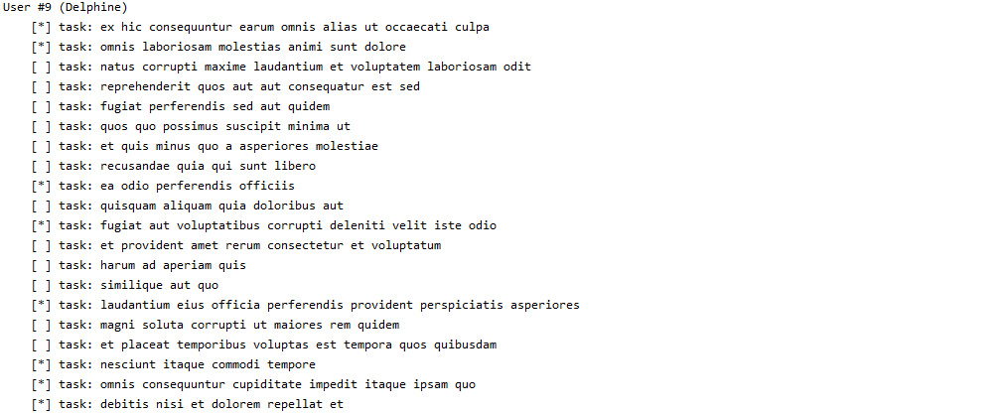

# spring-rest-openfeign

 
 

Example spring boot rest client using openfeign and spring scheduling. 
This client sends a request to <a href="https://jsonplaceholder.typicode.com">jsonplaceholder.typicode.com</a> every 20 seconds and prints list users and their todos as follows:

 
 

 
 

List of users: <a href="https://jsonplaceholder.typicode.com/users">jsonplaceholder.typicode.com/users</a>
 
List of todos: <a href="https://jsonplaceholder.typicode.com/todos">jsonplaceholder.typicode.com/todos</a>
